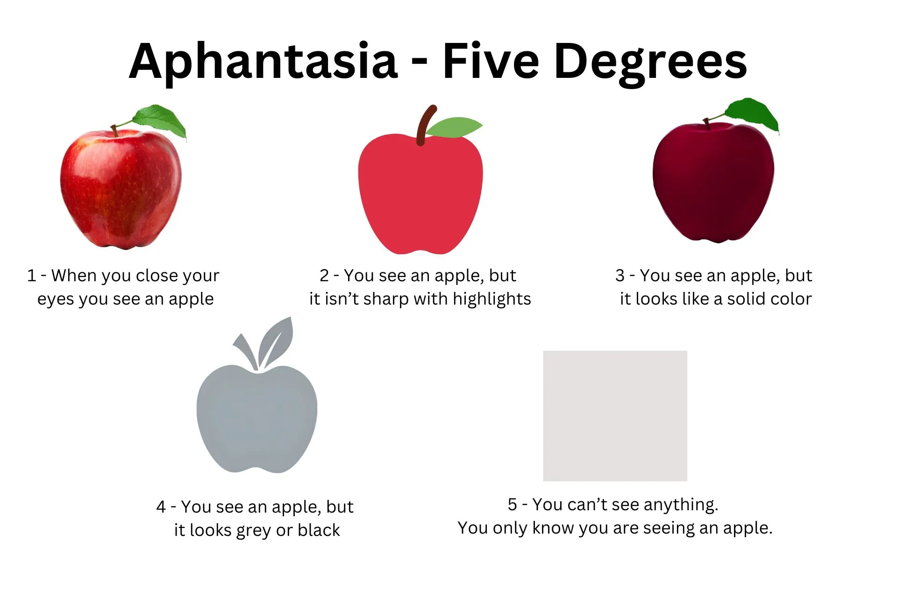

+++
date = '2026-02-11T22:59:32+08:00'
title = '只有我是這樣嗎？'
tags = ["BlogBlog.Club"]
+++

> [!info] BeforeREADING
> 這是參加**BlogBlog 同樂會**之「只有我這樣嗎？」（2026年2月第2期）的推文

# 只有我是這樣嗎？
## 心盲症
如果讓你閉上眼睛想像一個蘋果（姑且說是蘋果），你能看見嗎？還是一片漆黑

## 無內心聽覺
我不知道下一秒我會說什麼，只有說出來脫口而出的那個瞬間，我才知道我表達什麼。同理藝術表達與老師的溝通

## 二者buff疊加狀態下
